### sprint-2 
# WAPH-Web Application Programming and Hacking

## Instructor: Dr. Phu Phung

# Project Topic/Title - Mini Facebook

# Team members
1. Phani Gopaluni, gopaluna@mail.uc.edu
    * 
2. Koppula Rohith, koppulrh@mail.uc.edu
   * 
3. Sravan Kumar Bhavana, bhavansr@mail.uc.edu
   * 
4. Jaswanth Bollepalli, bollepjh@mail.uc.edu
   * 

# Project Management Information
[Source code repository (private access)](https://github.com/waph-team14/waph-teamproject)
[Project homepage (public)](https://github.com/waph-team14/waph-team14.github.io)

## Revision History
|Date       |Version    |Description    |
|-----------|-----------|---------------|
|24/03/2024 |0.1        |Sprint 0       |
|-----------|-----------|---------------|
|31/03/2024 |0.2        |Sprint 1       |
|-----------|-----------|---------------|
|21/04/2024 |0.3        |Sprint 2       |

# Overview
* In this team project, we are going to develop a mini facebook application with minimal features such as posting real time chat.
* To implement this project, the tech stack used is
   * Backend - PHP
   * Frontend - HTML, CSS (Bootstrap), JavaScript
   * Database - Relational, MySQL
   * Web Server - Apache2

# System Analysis
## High-level Requirements
The system will have two roles.
1. Normal User.
   * Registration
   * Login
   * Change Password
   * Edit Profile
   * Add a post
   * Edit or Delete their own posts
   * View the posts in home page.
   * View and add comments for each post.
   * Real time chat.
2. Super User 
   * Login (No Registration)
   * Disable a registered user
   * Enable a registered user

# System Design
## Use Case Realization
* The following diagrams explains the use cases for the normal user and also provide the details of tech stack.
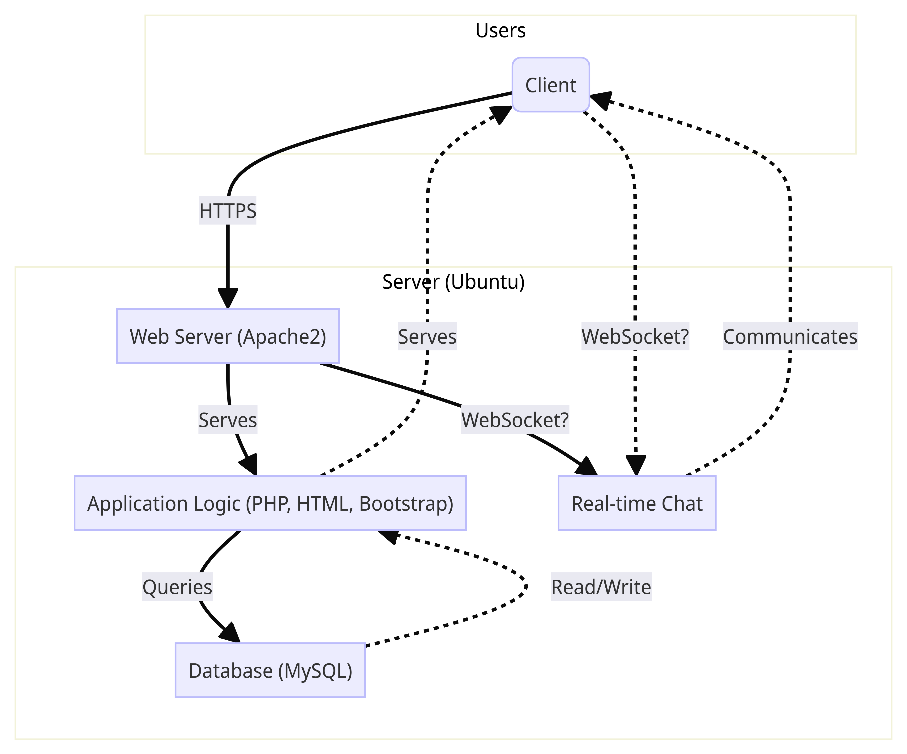
## Database 
* The following diagrams explains the entities and their relationships. Also shows the database schema that we are going to crate.
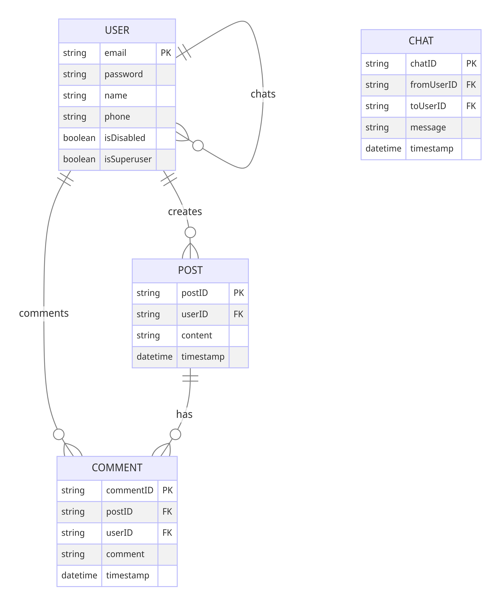
## User Interface
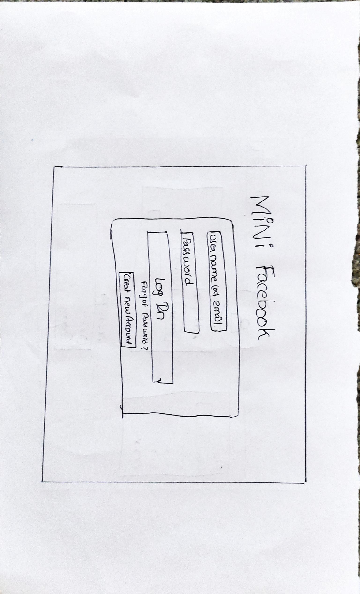

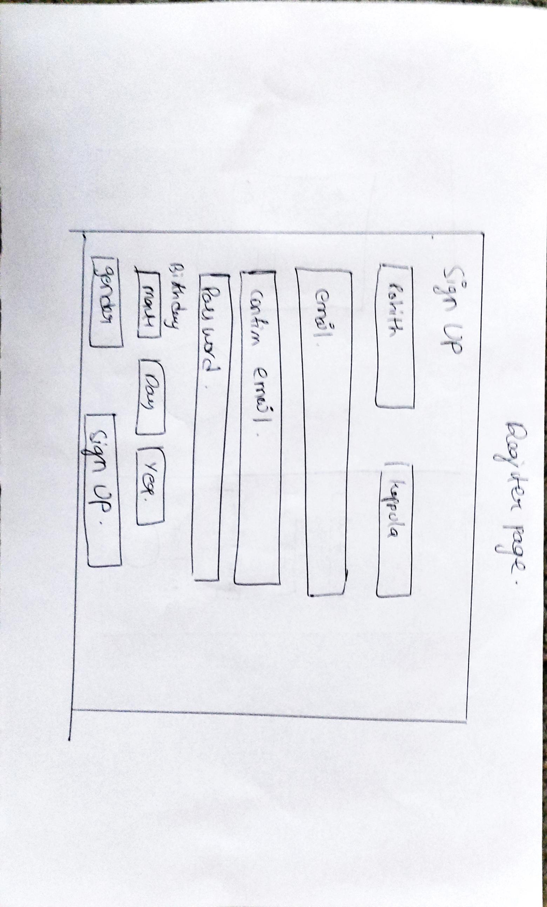

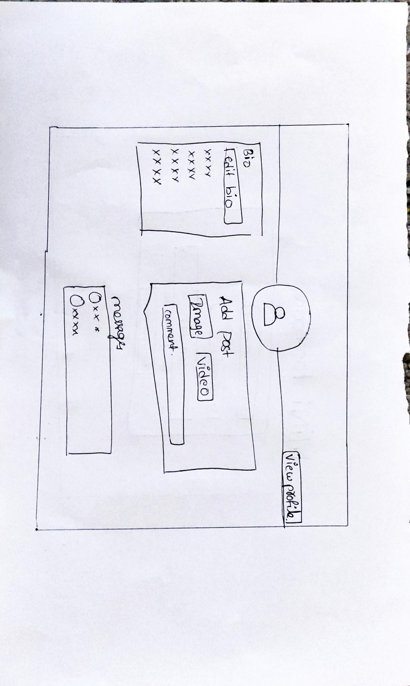

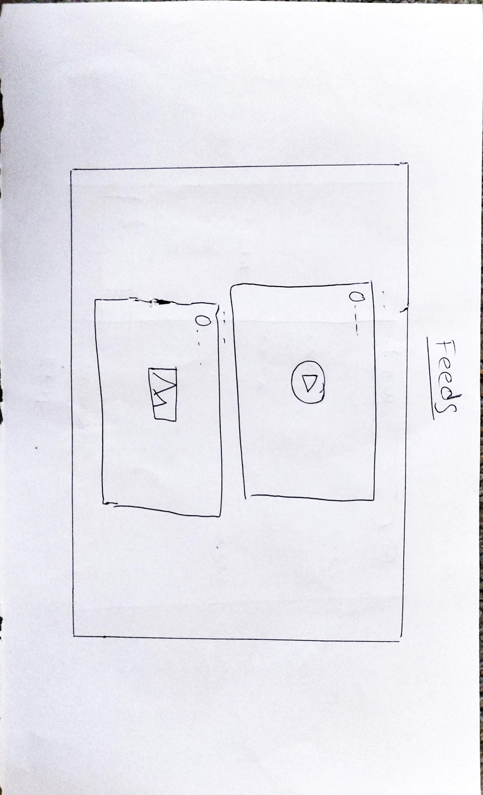

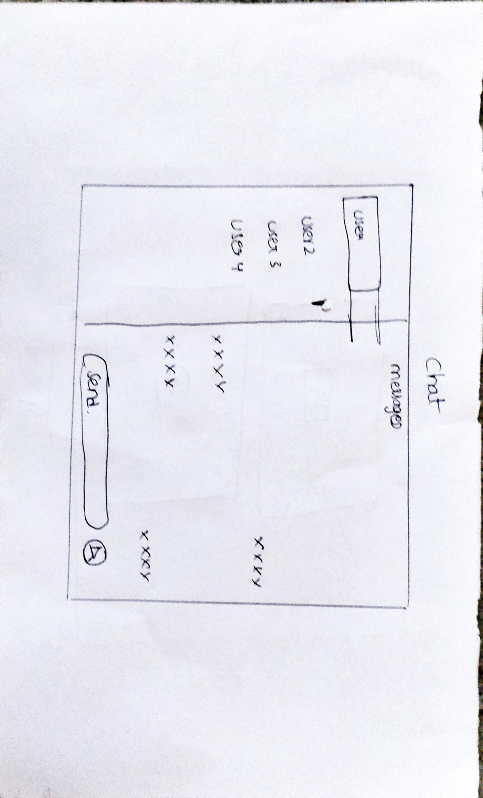

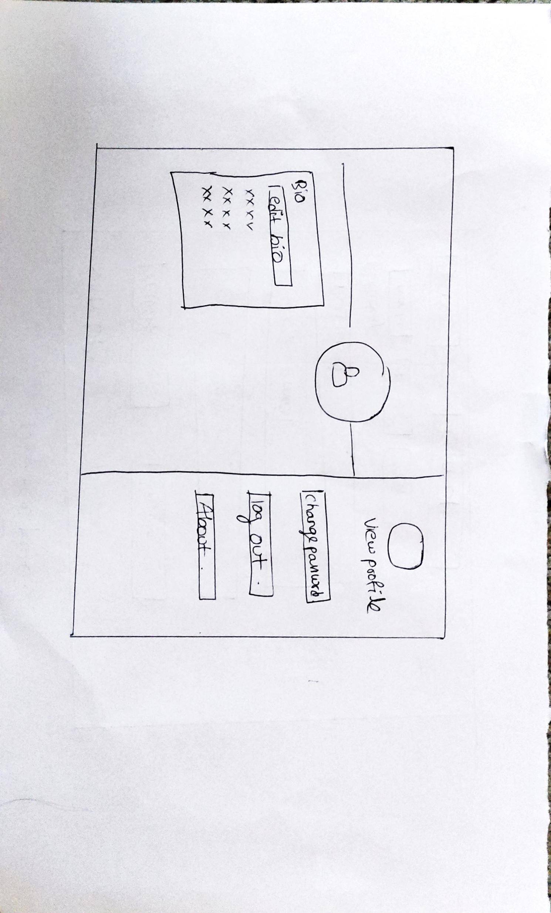

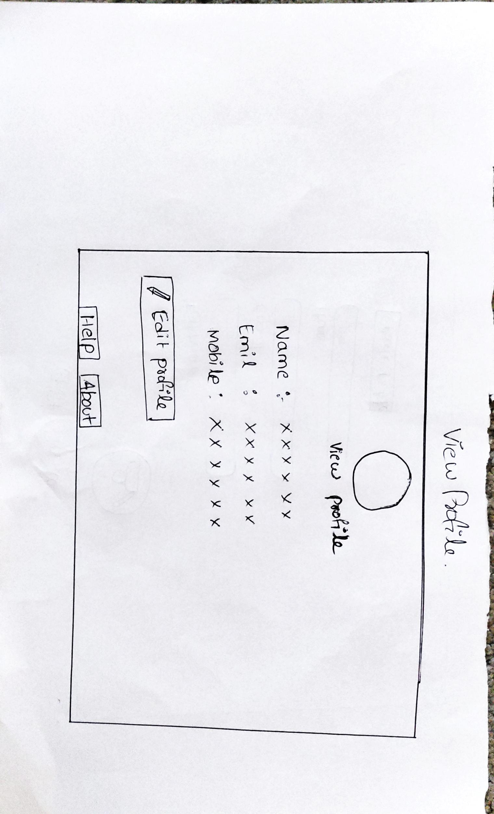

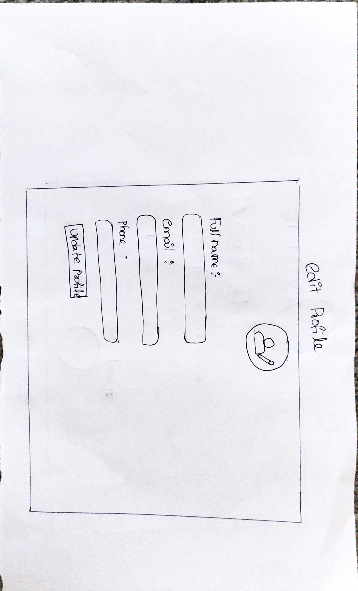


# Implementation
## Sprint 0
* Created private key and certificate for our local web server and a database for the project.
* Copied the code from lab3 and lab4 to setup sample login forms and home page.

## Sprint 1
* Run the following commands to setup the database. For the second command, use the password 1234.
```bash
sudo mysql -u root < database/database-account.sql
sudo mysql -u waphteam14 -p < database/database-data.sql
```
## Sprint 2
### Sprint 2
0. Update the README.md structures
   * database designing and implementation
  ## code for database implementation (creating posts code)
  in this code we created a table to store posts data 
  
  ```CREATE TABLE posts (
    postID INT AUTO_INCREMENT PRIMARY KEY,
    userID INT NOT NULL,
    title VARCHAR(100) NOT NULL,
    content TEXT NOT NULL,
    timestamp DATETIME DEFAULT CURRENT_TIMESTAMP,
    
		FOREIGN KEY (userID) REFERENCES users(userID) ON DELETE CASCADE
);
```
   * Planned Sprint 2
   * Divided the tasks among ourselves
### 2 logged in users can add a new post
logged in users can add a new post
to implement this feature we used this code in our project. this is the function we used in our project to addnewpost to our mini facebook page.
```
function addNewPost($userId, $postTitle, $postContent)
{
  $mysqli = new mysqli('localhost', 'waphteam14', '1234', 'waph_team');
  if ($mysqli->connect_errno) {
    printf("Database connection failed: %s\n", $mysqli->connect_errno);
    return false;
  }
``` 
### 3. logged in users can add a new comment on any post
   main funtion involved to add anew comment on any post is shown in this code
```
if (addNewComment($userId, $postId, $comment)) {
  $isSuccess = true;
  $errorMessage = "";
}

send_response($isSuccess, $errorMessage);

function send_response($isSuccess, $errorMessage)
{
  echo json_encode([
    "success" => $isSuccess,
    "errroMessage" => $errorMessage
  ]);
}

function addNewComment($userId, $postId, $comment)
{
  $mysqli = new mysqli('localhost', 'waphteam14', '1234', 'waph_team');
  if ($mysqli->connect_errno) {
    printf("Database connection failed: %s\n", $mysqli->connect_errno);
    return false;
  }
  ```
### 4. logged in user can edit like update and delete their own posts in the mini facebook app
this code is used in our project to delete their own post when user is on successful login
```
if (deletePost($postId)) {
  $isSuccess = true;
  $errorMessage = "";
}

send_response($isSuccess, $errorMessage);

function send_response($isSuccess, $errorMessage)
{
  echo json_encode([
    "success" => $isSuccess,
    "errorMessage" => $errorMessage
  ]);
}
```
### 5. logged in user cannot edit others posts
   we used used this funtionality in our project we are going to present a vedio representation about this indetail in our final work
### 6.   Created and designed Database queries
we added and created the database-data.sql file for this project and we submitted a copy of our database-data.sql file in this sprint.
* updated the src folder by removing old-src, update the repositor.

# Security analysis

# Demo (screenshots)
## Sprint - 0
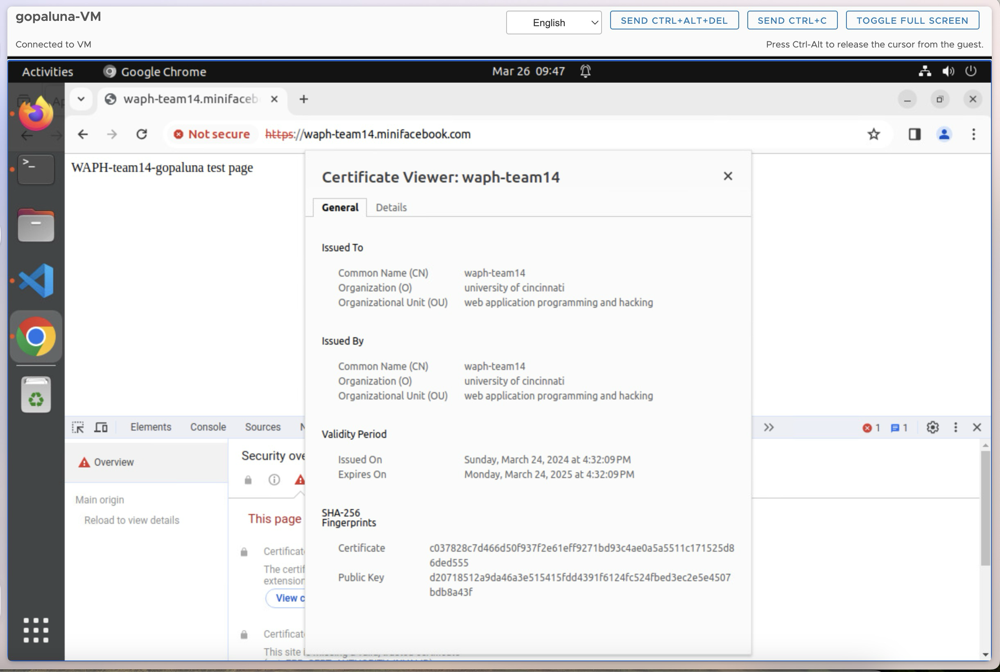
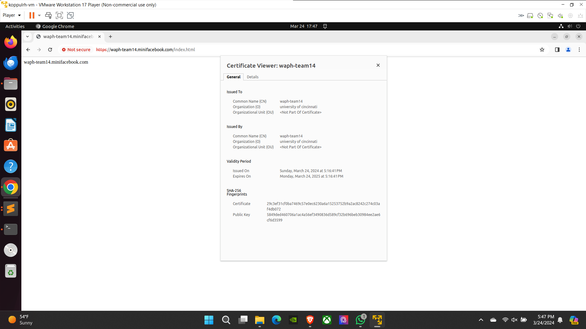
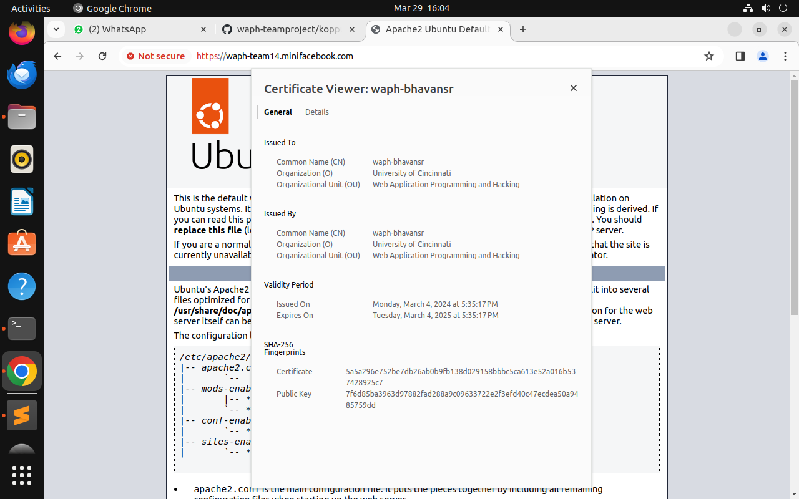
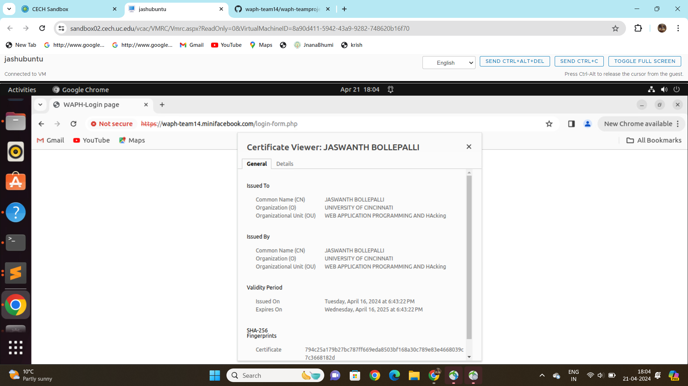

# Software Process Management
* Our team is following Agile Scrum Methodology.
* We are having weekly sprints. Sprint starts on Monday and Ends on Sunday.
* On Monday morning, we are having sprint planning to discuss the tasks that are to be done in the current sprint.
* We are having daily stand ups for 15 minutes to discuss progress everyday. Standup meeting notes is
   * What is done?
   * What is pending?
   * Any blockers?
* Since all of us are actively participating in development process, we are not having sprint retrospective meetings.

## Scrum process
### Roadmap
1. Setup and configure the server as per requirements.
2. Setup initial login flow copied from labs 3 & 4 and adds ample index.html for sprint 0 check up.
3. Sprint - 1
   * Finish the architecture diagram. - Phani
   * Finish the database schema design. - Phani
   * Create the SQL files for DDL statements and to insert some seed data. - Phani
   * Create Wireframes - Rohith
   * Code for the application (both frontend (using bootstrap for the frontend) and backend)
      * Finalize Registration Page - Sravan
      * Finalize Login Page - Sravan
      * Change password page. - Sravan
         * Should be inside profile page
         * Should have CSRF protection.
      * Edit profile page. - Rohith
         * Should be inside profile page.
      * Home page with list of posts. - Jaswanth
         * Should include a navbar with links to profile page, chat page, logout.
         * Just list the posts. We will work on comments in the next sprint.
4. Sprint - 2
   ***Note** for this Sprint the team as gown throught the **pair programming**, the team has gathered together
and implemented our ideas together and completed the sprint.
   * made several changes to the database.-phani
   * rewrote the login page -sravan
   * implemented changes to change password page -sravan
   * implemented changes to edit profile page -rohith
   * implemented and changes to the homme page -jaswanth
   * created posts page - phani
      * functions like add post delete post and update post were implemented.
      * comments on posts is implemeted.
6. Sprint - 3
7. Video Demo & Report Submission.

### Sprint 0
Duration: 18/03/2024-24/03/2024
#### Completed Tasks: 
1. Finished setting up ssl certificates and creating the local domain for waph-team14.minifacebook.com
2. Created a sample index.html file in the root directory of this new domain.
#### Contributions: 
1. Member 1, 5 commits, 4 hours, contributed in generating database and reprository and ssl key's and certificate and sample html file.
2. Phani Gopaluni, 3 commits, 4 hours, contributed in generating sample.html file and editing README.md
<<<<<<< HEAD
3. Sravan Kumar, 2 commits, 1 hour, contributed in verfying the tasks.
4. Jaswanth Bollepalli, 5 commits, 3 hours, contributed in editing README.md file and performing specific task
=======
3. Member 3, x commits, y hours, contributed in xxx
4. Jaswanth Bollepalli, 5 commits, 3 hours, contributed in editing README.md file performing specific task
>>>>>>> origin/main

### Sprint 1
Duration: 25/03/2024-31/03/2024
#### Completed Tasks: 
0. Update the README.md structures
   * Created Roadmap
   * Planned Sprint 1
   * Divided the tasks among ourselves
1. Created an architecture diagram realizing all the use cases.
2. Created an Entity Relation Ship Diagram that explains the Database Schema.
3. Crated Database DDL Statements

#### Contributions: 
1. Rohith Koppula, 5 commits, 4 hours, contributed in generating editProfile, view profile pages and wireframes for project layout and edited the README.md.
2. Phani Gopaluni, 8 commits, 4 hours, contributed in generating database-data.sql and generated architecture and ER diagrams and editing README.md
<<<<<<< HEAD
3. Sravan Kumar, 4 commits, 4 hours, contributed in creating login form, registration form and as well as forget password form with csrf validations and little styling to the forms.
4. Jaswanth Bollepalli, 6 commits, 4 hours, contributed in editing README.md file and tested the current database and gathered information for navigation bar included in our project .including navigatiom.html file including file links to logout.html,chat.html,profile.html
>>>>>>> origin/main

### Sprint 2
Duration: 16/04/2024-21/22/2024
#### Completed Tasks: 
0. Update the README.md structures
   * Created Roadmap
   * Planned Sprint 2
   * Did pair programming with the whole team
1. update Database and with new entities.
2. introduced new pages and updated previous pages  

#### Contributions: 
1. Rohith Koppula, 4 commits, 8 hours, contributed in generating editProfile, view profile pages and edited the README.md.
2. Phani Gopaluni, 10 commits, 8 hours, contributed in implementing new data in database-data.sql and created posts page along with several action for the post page involvements 
<<<<<<< HEAD
3. Sravan Kumar, 4 commits, 8 hours, implemented several changes on login page, registration page and as well as change password.
4. Jaswanth Bollepalli, 3 commits, 8 hours,implemented changes on css and tested the application during the development phase and contributed in creating the posts page with phani
>>>>>>> origin/main

***note:*** We finished the sprint by cooperating as a team, putting our ideas into practice through frequent feedback and project reconsiderations. This project phase has given us a lot of experience because we have discussed our ideas and executed them with a greater understanding.


# Appendix

Include the content (in text, not as images) of the SQL files and all source code of your PHP files (with the file name). 


