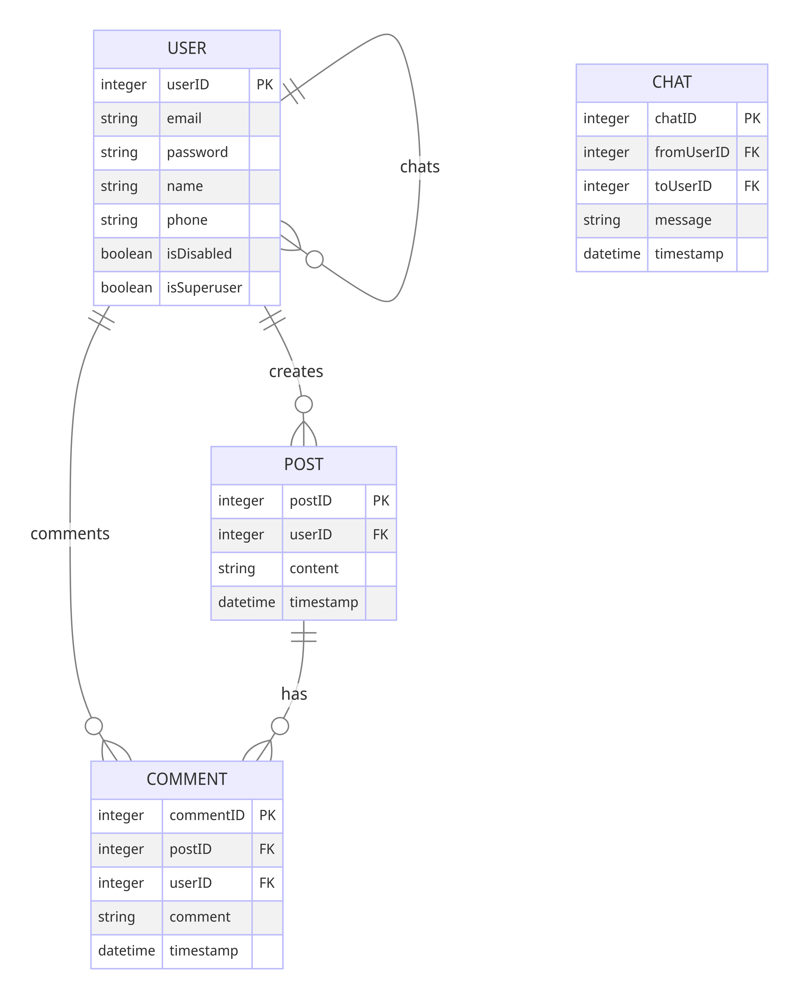
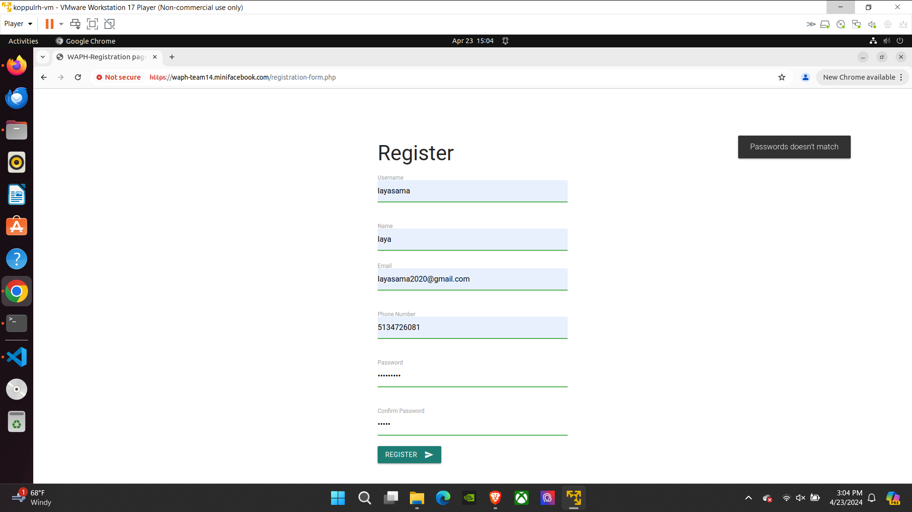

### Final Project Submisssion 
# WAPH-Web Application Programming and Hacking

## Instructor: Dr. Phu Phung

# Project Topic/Title - Mini Facebook

# Team members
1. Phani Gopaluni, gopaluna@mail.uc.edu
    * 
2. Koppula Rohith, koppulrh@mail.uc.edu
   * 
3. Sravan Kumar Bhavana, bhavansr@mail.uc.edu
   * 
4. Jaswanth Bollepalli, bollepjh@mail.uc.edu
   * 

# Project Management Information
A link to the team minifacebook [Source code repository (private access)](https://github.com/waph-team14/waph-teamproject)
<<<<<<< HEAD

A link to [Github (public)](https://github.com/waph-team14/waph-team14.github.io)
=======
A link to [Team Project homepage (public)](https://waph-team14.github.io)
>>>>>>>

# video url

[click_here_for_video_demonstration](https://mailuc-my.sharepoint.com/:v:/g/personal/koppulrh_mail_uc_edu/ERn_1j5e5QNNpTa-4Ru9AoIBuFcePPmVxapdXOIvdj-pKQ?e=PJB88j)

## Revision History
|Date       |Version    |Description    |
|-----------|-----------|---------------|
|24/03/2024 |0.1        |Sprint 0       |
|-----------|-----------|---------------|
|31/03/2024 |0.2        |Sprint 1       |
|-----------|-----------|---------------|
|21/04/2024 |0.3        |Sprint 2       |
|-----------|-----------|---------------|
|23/04/2024 |0.4        |Sprint 3       |

# Overview
* In this team project, we are going to develop a mini facebook application with minimal features such as posting real time chat.
* To implement this project, the tech stack used is
   * Backend - PHP
   * Frontend - HTML, CSS (Bootstrap), JavaScript
   * Database - Relational, MySQL
   * Web Server - Apache2

# System Analysis
## High-level Requirements
The system will have two roles.
1. Normal User.
   * Registration
   * Login
   * Change Password
   * Edit Profile
   * Add a post
   * Edit or Delete their own posts
   * View the posts in home page.
   * View and add comments for each post.
   * Real time chat.
2. Super User 
   * Login (No Registration)
   * Disable a registered user
   * Enable a registered user

# System Design
## Use Case Realization
* The following diagrams explains the use cases for the normal user and also provide the details of tech stack.

## Database 
* The following diagrams explains the entities and their relationships. Also shows the database schema that we are going to crate.

## User Interface


## Minifacebook Working flow and feature exploration

Functinalities of the minifacebook

Registration: Anybody can sign-up for the account.




Login: Invalid attempt and successful login methods.


Home page: Successfull user login directs to the homepage of the minifacebook.


A user can adding a post, delete it and can comment their own/other's post.


Edit profile: A way to update their profile information.


Change paswword: Changing password as per their need.


Superuser(Admin): A super user is an authority for the minifacebook.


A Superuser can disable and enable a registered user account.


A disabled user cannot login successfully.


### Security and Non-security functionalities

1. Our team project is deployed on HTTPS as https://waph-team14.minifacebook.com/index.php


2. Passwords are hashed when they are inserting into the database, and no root user account is used for maintaing the database.


3. All sql statements are prepared statements.


4. All inputs are validated in every layer. As per image shown, each code of the source files are followed in the same format.


5. HTML outputs are sanitized using json executions.


6. Role based

Regular user cannot login as superuser since superuser is directly credentials are directly inserted into the database, where as normal user or need to go through the registration process.

 

Regular user cannot edit/update posts of different users.


In this picture we can see that a superuser can only see the admin panel where as a regular user cannot have a admin panel.


7. Session authenctication and hijacking is prevented.


8. CSRF prevention, since session is prevented we cannot access the cookie information, so csrf implementation code is provided as csrf prevention.


9. Integrated with open-soruce css templates.


10. A team webiste is provided with team members information along with their personal protfolio websites.


# Implementation
## Sprint 0
* Created private key and certificate for our local web server and a database for the project.
* Copied the code from lab3 and lab4 to setup sample login forms and home page.

## Sprint 1
* Run the following commands to setup the database. For the second command, use the password 1234.
```bash
sudo mysql -u root < database/database-account.sql
sudo mysql -u waphteam14 -p < database/database-data.sql
```
## Sprint 2
### Sprint 2
0. Update the README.md structures
   * database designing and implementation
  ## code for database implementation (creating posts code)
  in this code we created a table to store posts data 

   * Planned Sprint 2
   * Divided the tasks among ourselves
   * 
### 2 logged in users can add a new post

### 3. logged in users can add a new comment on any post

### 4. logged in user can edit like update and delete their own posts in the mini facebook app

### 5. logged in user cannot edit others posts
   
### 6.   Created and designed Database queries


# Security analysis

# Demo (screenshots)
## Sprint - 0


# Software Process Management
* Our team is following Agile Scrum Methodology.
* We are having weekly sprints. Sprint starts on Monday and Ends on Sunday.
* On Monday morning, we are having sprint planning to discuss the tasks that are to be done in the current sprint.
* We are having daily stand ups for 15 minutes to discuss progress everyday. Standup meeting notes is
   * What is done?
   * What is pending?
   * Any blockers?
* Since all of us are actively participating in development process, we are not having sprint retrospective meetings.

## Scrum process
### Roadmap
1. Setup and configure the server as per requirements.
2. Setup initial login flow copied from labs 3 & 4 and adds ample index.html for sprint 0 check up.
3. Sprint - 1
   * Finish the architecture diagram. - Phani
   * Finish the database schema design. - Phani
   * Create the SQL files for DDL statements and to insert some seed data. - Phani
   * Create Wireframes - Rohith
   * Code for the application (both frontend (using bootstrap for the frontend) and backend)
      * Finalize Registration Page - Sravan
      * Finalize Login Page - Sravan
      * Change password page. - Sravan
         * Should be inside profile page
         * Should have CSRF protection.
      * Edit profile page. - Rohith
         * Should be inside profile page.
      * Home page with list of posts. - Jaswanth
         * Should include a navbar with links to profile page, chat page, logout.
         * Just list the posts. We will work on comments in the next sprint.
4. Sprint - 2
   ***Note** for this Sprint the team as gown throught the **pair programming**, the team has gathered together
and implemented our ideas together and completed the sprint.
   * made several changes to the database.-phani
   * rewrote the login page -sravan
   * implemented changes to change password page -sravan
   * implemented changes to edit profile page -rohith
   * implemented and changes to the homme page -jaswanth
   * created posts page - phani
      * functions like add post delete post and update post were implemented.
      * comments on posts is implemeted.
5. Sprint - 3 ***
 *Created a superuser - Phani,Sravan.*
 *Created the functionality and disabiling and enabiling functions - Rohith, Jaswanth.*
  Video demonstration and README edit - Sravan, Rohith.
6. Video Demo & Report Submission.

### Sprint 0
Duration: 18/03/2024-24/03/2024
#### Completed Tasks: 
1. Finished setting up ssl certificates and creating the local domain for waph-team14.minifacebook.com
2. Created a sample index.html file in the root directory of this new domain.
#### Contributions: 
1. Member 1, 5 commits, 4 hours, contributed in generating database and reprository and ssl key's and certificate and sample html file.
2. Phani Gopaluni, 3 commits, 4 hours, contributed in generating sample.html file and editing README.md
<<<<<<< HEAD
3. Sravan Kumar, 2 commits, 1 hour, contributed in verfying the tasks.
4. Jaswanth Bollepalli, 5 commits, 3 hours, contributed in editing README.md file and performing specific task
=======
3. Member 3, x commits, y hours, contributed in xxx
4. Jaswanth Bollepalli, 5 commits, 3 hours, contributed in editing README.md file performing specific task
>>>>>>> origin/main

### Sprint 1
Duration: 25/03/2024-31/03/2024
#### Completed Tasks: 
0. Update the README.md structures
   * Created Roadmap
   * Planned Sprint 1
   * Divided the tasks among ourselves
1. Created an architecture diagram realizing all the use cases.
2. Created an Entity Relation Ship Diagram that explains the Database Schema.
3. Crated Database DDL Statements

#### Contributions: 
1. Rohith Koppula, 5 commits, 4 hours, contributed in generating editProfile, view profile pages and wireframes for project layout and edited the README.md.
2. Phani Gopaluni, 8 commits, 4 hours, contributed in generating database-data.sql and generated architecture and ER diagrams and editing README.md
<<<<<<< HEAD
3. Sravan Kumar, 4 commits, 4 hours, contributed in creating login form, registration form and as well as forget password form with csrf validations and little styling to the forms.
4. Jaswanth Bollepalli, 6 commits, 4 hours, contributed in editing README.md file and tested the current database and gathered information for navigation bar included in our project .including navigatiom.html file including file links to logout.html,chat.html,profile.html
>>>>>>> origin/main

### Sprint 2
Duration: 16/04/2024-21/22/2024
#### Completed Tasks: 
0. Update the README.md structures
   * Created Roadmap
   * Planned Sprint 2
   * Did pair programming with the whole team
1. update Database and with new entities.
2. introduced new pages and updated previous pages  

#### Contributions: 
1. Rohith Koppula, 4 commits, 8 hours, contributed in generating editProfile, view profile pages and edited the README.md.
2. Phani Gopaluni, 10 commits, 8 hours, contributed in implementing new data in database-data.sql and created posts page along with several action for the post page involvements 
<<<<<<< HEAD
3. Sravan Kumar, 4 commits, 8 hours, implemented several changes on login page, registration page and as well as change password.
4. Jaswanth Bollepalli, 3 commits, 8 hours,implemented changes on css and tested the application during the development phase and contributed in creating the posts page with phani
>>>>>>> origin/main

### Sprint 3
Duration: 23/04/2024
#### Completed tasks:
1. Created a superuser can disable/enable an account.
   *  Did pair programming with whole team.
2. Verifiation of Superuser.

#### Contributions:
1. Sravan Kumar, 2 commit, 3 hours, contributed in working on superuser disable/enable of registered users and a bit css modifications and README modifying.
2. Phani, 1 hour, contributed on superuser disable/enable of registered users.
<<Lead
3. Rohith 3 commits, 3 hours Verfying the superuser logging and as well as verfied disabled account login and created video presentaton for the submission.
4. Jaswanth, Verfying the superuser logging and as well as verfied disabled account login and created video presentaton for the submission.
>>>>>>> origin/main


***note:*** We finished the sprint by cooperating as a team, putting our ideas into practice through frequent feedback and project reconsiderations. This project phase has given us a lot of experience because we have discussed our ideas and executed them with a greater understanding.


# Appendix

# Source code to Markdown
This file is automatically created by a script. Please delete this line and replace with the course and your team information accordingly.
## /enable-user.php
```php
<?php
// ini_set( 'display_errors', '1');
// ini_set( 'display_startup_errors', '1');
// error_reporting (E_ALL); 
require "session_auth.php";
header('Content-Type: application/json');

$userId = sanitize_input($_POST["userId"]);

$isSuccess = false;
$errorMessage = 'Some Unknown Error Occurred';

function sanitize_input($input)
{
  $input = trim($input);
  $input = stripslashes($input);
  $input = htmlspecialchars($input);
  return $input;
}

$token = $_POST["nocsrftoken"];
if (!isset($token) or ($token != $_SESSION["nocsrftoken"])) {
  $errorMessage = "CSRF Attack is detected";
  send_response($isSuccess, $errorMessage);
  die();
}

if (enableUser($userId)) {
  $isSuccess = true;
  $errorMessage = "";
}

send_response($isSuccess, $errorMessage);

function send_response($isSuccess, $errorMessage)
{
  echo json_encode([
    "success" => $isSuccess,
    "errorMessage" => $errorMessage
  ]);
}

function enableUser($userId)
{
  global $errorMessage;
  $mysqli = new mysqli('localhost', 'waphteam14', '1234', 'waph_team');
  if ($mysqli->connect_errno) {
    printf("Database connection failed: %s\n", $mysqli->connect_errno);
    return false;
  }

  $prepared_sql = "UPDATE waph_team.users SET isDisabled=false WHERE userID=?";
  $stmt = $mysqli->prepare($prepared_sql);
  $stmt->bind_param("d", $userId);

  if ($stmt->execute()) {
    if ($stmt->affected_rows == 1) {
      return true;
    } else {
      $errorMessage = "User doesn't exist in the database";
    }
  }
  return false;
}

```
## /list-all-posts.php
```php
<?php

require "session_auth.php";

$isSuccess = false;
$errorMessage = 'Some Unknown Error Occurred';
$posts = [];

if (listAllPosts()) {
  $isSuccess = true;
  $errorMessage = "";
}

send_response($isSuccess, $errorMessage, $posts);

function send_response($isSuccess, $errorMessage, $posts)
{
  echo json_encode([
    "success" => $isSuccess,
    "errroMessage" => $errorMessage,
    "data" => $posts
  ]);
}

function listAllPosts()
{
  global $posts;
  $mysqli = new mysqli('localhost', 'waphteam14', '1234', 'waph_team');
  if ($mysqli->connect_errno) {
    printf("Database connection failed: %s\n", $mysqli->connect_errno);
    return false;
  }

  $prepared_sql = "
    WITH post_details AS (
      SELECT
        p.postID,
        p.timestamp AS postedTime,
        JSON_OBJECT (
          'title', p.title, 'content', p.content, 'postedUser', u.name
        ) AS post,
        JSON_OBJECT (
          'commentId', c.commentID,
          'comment', c.comment,
          'commenterName', uc.name
        ) AS commentDetail
      FROM posts p
      JOIN users u ON p.userID = u.userID
      LEFT JOIN comments c ON p.postID = c.postID
      LEFT JOIN users uc on c.userID = uc.userID
      ORDER BY p.timestamp DESC, c.timestamp
    )

    SELECT JSON_OBJECT(
      'postID', pd.postID,
      'details', pd.post,
      'comments', JSON_ARRAYAGG(pd.commentDetail)
    ) AS post
    FROM post_details pd
    GROUP BY pd.postID
    ORDER BY pd.postedTime DESC
  ";
  $stmt = $mysqli->prepare($prepared_sql);
  if ($stmt->execute()) {
    $result = $stmt->get_result();
    while ($row = $result->fetch_assoc()) {
      $posts[] = $row;
    }
    return true;
  }
  return false;
}

```
## /changepasswordform.php
```php
<?php
require "session_auth.php";

$rand = bin2hex(openssl_random_pseudo_bytes(16));
$_SESSION["nocsrftoken"] = $rand;
?>
<!DOCTYPE html>
<html lang="en">

<head>
  <meta charset="utf-8">
  <title>Change Password</title>
</head>

<body>
  <!-- Compiled and minified CSS -->
  <link rel="stylesheet" href="https://cdnjs.cloudflare.com/ajax/libs/materialize/1.0.0/css/materialize.min.css">
  <link href="https://fonts.googleapis.com/icon?family=Material+Icons" rel="stylesheet">

  <!-- Compiled and minified JavaScript -->
  <script src="https://cdnjs.cloudflare.com/ajax/libs/materialize/1.0.0/js/materialize.min.js"></script>

  <style>
    /* Center the form on the page */
    .valign-wrapper {
      width: 100%;
      height: 100vh;
      display: flex;
      align-items: center;
      justify-content: center;
    }

    .form-container {
      width: 50%;
      max-width: 400px;
    }
  </style>

  <div class="container">
    <nav>
			<div class="nav-wrapper blue">
				<a href="index.php" class="brand-logo p2">Mini Facebook</a>
				<ul id="nav-mobile" class="right hide-on-med-and-down">
					<li><a href="index.php">Home</a></li>
				</ul>
			</div>
		</nav>
    <div class="valign-wrapper">
      <div class="form-container">
        <h3>Change Password</h3>
        <form action="changepassword.php" onsubmit="return validateForm()" method="POST" class="col s12">
          <div class="row">
            <input type="hidden" name="nocsrftoken" value="<?php echo $rand; ?>" />
            <div class="input-field col s12">
              <input name="password" id="password" type="password" class="validate" required pattern=".{6,}">
              <label for="password">New Password</label>
              <span class="helper-text" data-error="Invalid password" data-success="">Minimum 6 characters</span>
            </div>
            <div class="input-field col s12">
              <input name="confirmPassword" id="confirmPassword" type="password" class="validate" required>
              <label for="password">Confirm New Password</label>
            </div>
            <div class="col s12">
              <button class="btn waves-effect waves-light" name="action" type="submit">Change Password
                <i class="material-icons right">send</i>
              </button>
            </div>
          </div>
        </form>
      </div>
    </div>
  </div>

  <script>
    function validateForm() {
      let password = document.getElementById('password').value;
      let confirmPassword = document.getElementById('confirmPassword').value;

      if (password !== confirmPassword) {
        M.toast({
          html: `Passwords doesn't match`
        });
        return false;
      }

      return true;
    }
  </script>
</body>

</html>
```
## /add-post.php
```php
<?php
// ini_set( 'display_errors', '1');
// ini_set( 'display_startup_errors', '1');
// error_reporting (E_ALL); 
require "session_auth.php";
header('Content-Type: application/json');

$userId = sanitize_input($_SESSION["userId"]);
$postTitle = sanitize_input($_POST["post-title"]);
$postContent = sanitize_input($_POST["post-content"]);

$isSuccess = false;
$errorMessage = 'Some Unknown Error Occurred';

function sanitize_input($input)
{
  $input = trim($input);
  $input = stripslashes($input);
  $input = htmlspecialchars($input);
  return $input;
}

$token = $_POST["nocsrftoken"];
if (!isset($token) or ($token != $_SESSION["nocsrftoken"])) {
  $errorMessage = "CSRF Attack is detected";
  send_response($isSuccess, $errorMessage);
  die();
}

if (addNewPost($userId, $postTitle, $postContent)) {
  $isSuccess = true;
  $errorMessage = "";
}

send_response($isSuccess, $errorMessage);

function send_response($isSuccess, $errorMessage)
{
  echo json_encode([
    "success" => $isSuccess,
    "errroMessage" => $errorMessage
  ]);
}

function addNewPost($userId, $postTitle, $postContent)
{
  $mysqli = new mysqli('localhost', 'waphteam14', '1234', 'waph_team');
  if ($mysqli->connect_errno) {
    printf("Database connection failed: %s\n", $mysqli->connect_errno);
    return false;
  }

  $prepared_sql = "INSERT INTO waph_team.posts (userID, title, content) VALUES(?, ?, ?);";
  $stmt = $mysqli->prepare($prepared_sql);
  $stmt->bind_param("dss", $userId, $postTitle, $postContent);

  if ($stmt->execute()) {
    if ($stmt->affected_rows == 1) {
      return true;
    }
  }
  return false;
}

```
## /session_auth.php
```php
<?php
$lifetime = 15 * 60;
$path = "/";
$domain = "waph-team14.minifacebook.com";
$secure = true;
$httponly = true;
session_set_cookie_params($lifetime, $path, $domain, $secure, $httponly);
session_start();

if (!isset($_SESSION["authenticated"]) or $_SESSION["authenticated"] != TRUE) {
  session_destroy();
  echo "<script>alert('You have not login. Please login first!')</script>";
  header("Refresh: 0; url=login-form.php");
  die();
}

if ($_SESSION["browser"] != $_SERVER["HTTP_USER_AGENT"]) {
  session_destroy();
  echo "<script>alert('Session Hijacking is Detected')</script>";
  header("Refresh: 0; url=login-form.php");
  die();
}

```
## /disable-user.php
```php
<?php
// ini_set( 'display_errors', '1');
// ini_set( 'display_startup_errors', '1');
// error_reporting (E_ALL); 
require "session_auth.php";
header('Content-Type: application/json');

$userId = sanitize_input($_POST["userId"]);

$isSuccess = false;
$errorMessage = 'Some Unknown Error Occurred';

function sanitize_input($input)
{
  $input = trim($input);
  $input = stripslashes($input);
  $input = htmlspecialchars($input);
  return $input;
}

$token = $_POST["nocsrftoken"];
if (!isset($token) or ($token != $_SESSION["nocsrftoken"])) {
  $errorMessage = "CSRF Attack is detected";
  send_response($isSuccess, $errorMessage);
  die();
}

if (disableUser($userId)) {
  $isSuccess = true;
  $errorMessage = "";
}

send_response($isSuccess, $errorMessage);

function send_response($isSuccess, $errorMessage)
{
  echo json_encode([
    "success" => $isSuccess,
    "errorMessage" => $errorMessage
  ]);
}

function disableUser($userId)
{
  global $errorMessage;
  $mysqli = new mysqli('localhost', 'waphteam14', '1234', 'waph_team');
  if ($mysqli->connect_errno) {
    printf("Database connection failed: %s\n", $mysqli->connect_errno);
    return false;
  }

  $prepared_sql = "UPDATE waph_team.users SET isDisabled=true WHERE userID=?";
  $stmt = $mysqli->prepare($prepared_sql);
  $stmt->bind_param("d", $userId);

  if ($stmt->execute()) {
    if ($stmt->affected_rows == 1) {
      return true;
    } else {
      $errorMessage = "User doesn't exist in the database";
    }
  }
  return false;
}

```
## /login-form.php
```php
<!DOCTYPE html>
<html lang="en">

<head>
  <meta charset="utf-8">
  <title>WAPH-Login page</title>
</head>

<body>
  <!-- Compiled and minified CSS -->
  <link rel="stylesheet" href="https://cdnjs.cloudflare.com/ajax/libs/materialize/1.0.0/css/materialize.min.css">
  <link href="https://fonts.googleapis.com/icon?family=Material+Icons" rel="stylesheet">

  <!-- Compiled and minified JavaScript -->
  <script src="https://cdnjs.cloudflare.com/ajax/libs/materialize/1.0.0/js/materialize.min.js"></script>

  <style>
    /* Center the form on the page */
    .valign-wrapper {
      width: 100%;
      height: 100vh;
      display: flex;
      align-items: center;
      justify-content: center;
    }

    .form-container {
      width: 50%;
      max-width: 400px;
    }
  </style>

  <div class="container">
    <div class="valign-wrapper">
      <div class="form-container">
        <h3>Login</h3>
        <form action="index.php" method="POST" class="col s12">
          <div class="row">
            <div class="input-field col s12">
              <input name="username" id="username" type="text" class="validate" required>
              <label for="username">Username</label>
              <span class="helper-text" data-error="Invalid username" data-success=""></span>
            </div>

            <div class="input-field col s12">
              <input name="password" id="password" type="password" class="validate" required pattern=".{6,}">
              <label for="password">Password</label>
              <span class="helper-text" data-error="Invalid password" data-success="">Minimum 6 characters</span>
            </div>

            <div class="col s12">
              <button class="btn waves-effect waves-light" name="action" type="submit">Login
                <i class="material-icons right">send</i>
              </button>
            </div>
          </div>
        </form>
        <p>New User? <a href="registration-form.php">Register</a></p>
      </div>
    </div>
  </div>
</body>

</html>
```
## /update-post.php
```php
<?php
// ini_set( 'display_errors', '1');
// ini_set( 'display_startup_errors', '1');
// error_reporting (E_ALL); 
require "session_auth.php";
header('Content-Type: application/json');

$postId = sanitize_input($_POST["postId"]);
$postTitle = sanitize_input($_POST["title"]);
$postContent = sanitize_input($_POST["content"]);

$isSuccess = false;
$errorMessage = 'Some Unknown Error Occurred';

function sanitize_input($input)
{
  $input = trim($input);
  $input = stripslashes($input);
  $input = htmlspecialchars($input);
  return $input;
}

$token = $_POST["nocsrftoken"];
if (!isset($token) or ($token != $_SESSION["nocsrftoken"])) {
  $errorMessage = "CSRF Attack is detected";
  send_response($isSuccess, $errorMessage);
  die();
}

if (updatePost($postId, $postTitle, $postContent)) {
  $isSuccess = true;
  $errorMessage = "";
}

send_response($isSuccess, $errorMessage);

function send_response($isSuccess, $errorMessage)
{
  echo json_encode([
    "success" => $isSuccess,
    "errorMessage" => $errorMessage
  ]);
}

function updatePost($postId, $postTitle, $postContent)
{
  global $errorMessage;
  $mysqli = new mysqli('localhost', 'waphteam14', '1234', 'waph_team');
  if ($mysqli->connect_errno) {
    printf("Database connection failed: %s\n", $mysqli->connect_errno);
    return false;
  }

  $prepared_sql = "UPDATE waph_team.posts set title=?, content=? where postId=?";
  $stmt = $mysqli->prepare($prepared_sql);
  $stmt->bind_param("ssd", $postTitle, $postContent, $postId);

  if ($stmt->execute()) {
    if ($stmt->affected_rows == 1) {
      return true;
    } else {
      $errorMessage = "Neither title nor content is modified.";
    }
  }
  return false;
}

```
## /delete-post.php
```php
<?php
// ini_set( 'display_errors', '1');
// ini_set( 'display_startup_errors', '1');
// error_reporting (E_ALL); 
require "session_auth.php";
header('Content-Type: application/json');

$postId = sanitize_input($_POST["postId"]);

$isSuccess = false;
$errorMessage = 'Some Unknown Error Occurred';

function sanitize_input($input)
{
  $input = trim($input);
  $input = stripslashes($input);
  $input = htmlspecialchars($input);
  return $input;
}

$token = $_POST["nocsrftoken"];
if (!isset($token) or ($token != $_SESSION["nocsrftoken"])) {
  $errorMessage = "CSRF Attack is detected";
  send_response($isSuccess, $errorMessage);
  die();
}

if (deletePost($postId)) {
  $isSuccess = true;
  $errorMessage = "";
}

send_response($isSuccess, $errorMessage);

function send_response($isSuccess, $errorMessage)
{
  echo json_encode([
    "success" => $isSuccess,
    "errorMessage" => $errorMessage
  ]);
}

function deletePost($postId)
{
  global $errorMessage;
  $mysqli = new mysqli('localhost', 'waphteam14', '1234', 'waph_team');
  if ($mysqli->connect_errno) {
    printf("Database connection failed: %s\n", $mysqli->connect_errno);
    return false;
  }

  $prepared_sql = "DELETE FROM waph_team.posts WHERE postId=?";
  $stmt = $mysqli->prepare($prepared_sql);
  $stmt->bind_param("d", $postId);

  if ($stmt->execute()) {
    if ($stmt->affected_rows == 1) {
      return true;
    } else {
      $errorMessage = "Post doesn't exist in the database";
    }
  }
  return false;
}

```
## /addnewuser.php
```php
<?php
ini_set('display_errors', 1);
ini_set('display_startup_errors', 1);
error_reporting(E_ALL);
$username = sanitize_input($_POST["username"]);
$password = sanitize_input($_POST["password"]);
$name = sanitize_input($_POST["name"]);
$email = sanitize_input($_POST["email"]);
$phone = sanitize_input($_POST["phone"]);

if (validate_form($username, $password, $name, $email, $phone)) {
	$code = addnewuser($username, $password, $name, $email, $phone);
	if ($code == 1) {
		echo "Registration succeed!";
	} else if ($code == -3) {
		echo "Registration failed";
	} else if ($code == -2) {
		echo "Username already exists";
	} else {
		echo "Some unknown error occured";
	}
}

function validate_form($username, $password, $name, $email, $phone)
{
	if (!(isset($username) and isset($password) and isset($name) and isset($email))) {
		echo "all the fields are not set properly";
		return false;
	}
	if ((empty($username) or empty($password) or empty($name) or empty($email))) {
		echo "some fields are empty";
		return false;
	}
	if (!preg_match("/^[\w.-]+@[\w-]+(.[\w-]+)*$/", $email)) {
		echo "email regex didn't matched";
		return false;
	};
	if (!preg_match("/.{6,}/", $password)) {
		echo "password regex didn't matched";
		return false;
	}
	if (!preg_match("/[0-9]{10}/", $phone)) {
		echo "phone number regex didn't matched";
		return false;
	}
	return true;
}

function sanitize_input($input)
{
	$input = trim($input);
	$input = stripslashes($input);
	$input = htmlspecialchars($input);
	return $input;
}

function addnewuser(
	$username,
	$password,
	$name,
	$email,
  $phone
) {
	$mysqli = new mysqli('localhost', 'waphteam14', '1234', 'waph_team');

	if ($mysqli->connect_errno) {
		printf("Database connection failed: %s\n", $mysqli->connect_errno);
		return -1;
	}

	$username_check_sql = "SELECT * FROM users WHERE username = ?";
	$username_check_stmt = $mysqli->prepare($username_check_sql);
	$username_check_stmt->bind_param("s", $username);

	$username_check_stmt->execute();
	$result = $username_check_stmt->get_result();
	if ($result->num_rows > 0)
		return -2;

	$prepared_sql = "INSERT INTO users (username, password, name, email, phone, isDisabled, isSuperuser) VALUES (?, md5(?), ?, ?, ?, false, false)";
	$stmt = $mysqli->prepare($prepared_sql);
	$stmt->bind_param("sssss", $username, $password, $name, $email, $phone);

	if ($stmt->execute()) {
		return 1;
	}
	return -3;
}
?>

<p><a href="login-form.php">Login</a></p>
```
## /logout.php
```php
<?php
session_start();
session_destroy();
?>

<!DOCTYPE html>
<html lang="en">
<head>
<meta charset="UTF-8">
<meta name="viewport" content="width=device-width, initial-scale=1.0">
<title>Logout</title>
<!-- Bootstrap CSS -->
<link href="https://stackpath.bootstrapcdn.com/bootstrap/4.5.2/css/bootstrap.min.css" rel="stylesheet">
<style>
    body {
        background-color: #f8f9fa;
    }
    .container {
        margin-top: 50px;
    }
    .logout-message {
        background-color: #007bff;
        color: #fff;
        padding: 20px;
        border-radius: 5px;
        display: none;
    }
    .logout-message.slide-in {
        display: block;
        animation: slide-in 1s ease-in-out;
    }
    @keyframes slide-in {
        0% { transform: translateY(-100%); }
        100% { transform: translateY(0); }
    }
</style>
</head>
<body>
<div class="container">
    <div class="row">
        <div class="col-md-6 offset-md-3">
            <div class="logout-message slide-in">
                <p>You are logged out!</p>
                <a href="login-form.php" class="btn btn-primary">Login again</a>
            </div>
        </div>
    </div>
</div>

<!-- jQuery and Bootstrap JS -->
<script src="https://code.jquery.com/jquery-3.5.1.slim.min.js"></script>
<script src="https://cdn.jsdelivr.net/npm/@popperjs/core@2.5.4/dist/umd/popper.min.js"></script>
<script src="https://stackpath.bootstrapcdn.com/bootstrap/4.5.2/js/bootstrap.min.js"></script>

<script>
    // Show the logout message with sliding animation
    $(document).ready(function(){
        $(".logout-message").addClass("slide-in");
    });
</script>
</body>
</html>

```
## /index.php
```php
<?php
// ini_set( 'display_errors', '1');
// ini_set( 'display_startup_errors', '1');
// error_reporting (E_ALL); 
$lifetime = 15 * 60;
$path = "/";
$domain = "waph-team14.minifacebook.com";
$secure = true;
$httponly = true;
session_set_cookie_params($lifetime, $path, $domain, $secure, $httponly);
session_start();

$rand = bin2hex(openssl_random_pseudo_bytes(16));
$_SESSION["nocsrftoken"] = $rand;

$username = sanitize_input($_POST["username"]);
$password = sanitize_input($_POST["password"]);

function sanitize_input($input)
{
	$input = trim($input);
	$input = stripslashes($input);
	$input = htmlspecialchars($input);
	return $input;
}

if (isset($_POST["username"]) and isset($_POST["password"])) {
	if (checklogin_mysql($username, $password)) {
		$_SESSION["authenticated"] = TRUE;
		$_SESSION["username"] = $username;
		$_SESSION["browser"] = $_SERVER["HTTP_USER_AGENT"];
	} else {
		session_destroy();
		echo "<script>alert('Invalid username/password or Account is Disabled');window.location='login-form.php';</script>";
		die();
	}
}

require "session_auth.php";

function checklogin_mysql($username, $password)
{
	$mysqli = new mysqli('localhost', 'waphteam14', '1234', 'waph_team');
	if ($mysqli->connect_errno) {
		printf("Database connection failed: %s\n", $mysqli->connect_errno);
		exit();
	}

	$prepared_sql = "SELECT userId, name, email, additionalEmail, phone, isSuperuser FROM users WHERE username = ? AND password = md5(?) AND isDisabled = false;";
	$stmt = $mysqli->prepare($prepared_sql);
	$stmt->bind_param("ss", $username, $password);
	$stmt->execute();
	$stmt->store_result();

	if ($stmt->num_rows == 1) {
		$userId = null;
		$name = null;
		$email = null;
		$additionalEmail = null;
		$phone = null;
		$isSuperuser = null;
		$stmt->bind_result($userId, $name, $email, $additionalEmail, $phone, $isSuperuser);
		$stmt->fetch();

		$_SESSION["userId"] = $userId;
		$_SESSION["name"] = $name;
		$_SESSION["email"] = $email;
		$_SESSION["additionalEmail"] = $additionalEmail;
		$_SESSION["phone"] = $phone;
		$_SESSION["isSuperuser"] = $isSuperuser;

		return TRUE;
	}
	return FALSE;
}
?>

<body>
	<script src="https://code.jquery.com/jquery-3.7.1.min.js" integrity="sha256-/JqT3SQfawRcv/BIHPThkBvs0OEvtFFmqPF/lYI/Cxo=" crossorigin="anonymous"></script>
	<!-- Compiled and minified CSS -->
	<link rel="stylesheet" href="https://cdnjs.cloudflare.com/ajax/libs/materialize/1.0.0/css/materialize.min.css">
	<link href="https://fonts.googleapis.com/icon?family=Material+Icons" rel="stylesheet">

	<!-- Compiled and minified JavaScript -->
	<script src="https://cdnjs.cloudflare.com/ajax/libs/materialize/1.0.0/js/materialize.min.js"></script>

	<nav>
		<div class="nav-wrapper blue">
			<a href="index.php" class="brand-logo p2">Mini Facebook</a>
			<ul id="nav-mobile" class="right hide-on-med-and-down">
				<?php
				if ($_SESSION['isSuperuser'] && $_SESSION['isSuperuser'] == true) {
					echo "<li><a href='admin-panel.php'>Admin Panel</a></li>";
				}
				?>
				<li><a href="posts-page.php">Posts</a></li>
				<li><a href="editprofileform.php">Profile</a></li>
				<li><a href="logout.php">Logout</a></li>
			</ul>
		</div>
	</nav>

	<div class="container">
		<div class="row">
			<section class="col s8 offset-s4">
				<input type="hidden" id="nocsrftoken" value="<?php echo $rand; ?>" />
				<div id="posts-wrapper">

				</div>
			</section>
		</div>
	</div>

	<script>
		function createCommentSection(comment) {
			if (!comment.comment) return ``;
			return `
				<div>
					<hr>
					<p><strong> Comment by ${comment.commenterName} </strong></p>
					<p>${comment.comment}</p>
				</div>
			`
		}

		function createAPostCard(post) {
			const postCard = `
			<div class="row">
				<div class="col s12 m6">
				<div class="card darken-1">
						<div class="card-content">
							<span class="card-title"> Post by ${post.details.postedUser}</span>
							<p class="post-title" type='text'><strong>${post.details.title}</strong></p>
							<p class="materialize-p post-content" style="height: auto">${post.details.content}</p>
							${post.comments.map(createCommentSection).join('')}
						</div>
						<div class="card-action">
							<div class="input-field col s12">
								<input name="post-comment" type="text" class="validate post-comment">
								<label class="active" for="post-comment">Comment</label>
							</div>
							<a class="btn waves-effect waves-light post-add-comment" data-id="${post.postID}">
								Add Comment<i class="material-icons right">comment</i>
							</a>
						</div>
					</div>
				</div>
			</div>
		`;
			return postCard;
		}

		$(window).on('load', () => {
			$.ajax({
				url: 'list-all-posts.php',
				type: 'GET',
				success: (response) => {
					const results = JSON.parse(response);
					if (results.success) {
						results.data.forEach(result => {
							const post = JSON.parse(result.post);
							console.log(post);
							const postCard = createAPostCard(post);
							$('#posts-wrapper').append(postCard);
						})
					}
				}
			})
		})

		$(document).on('click', '.post-add-comment', function(event) {

			const nocsrftoken = $('#nocsrftoken').val();
			const postId = $(this).data("id");
			const comment = $(this).closest('.card-action').find('.post-comment').val()

			$.ajax({
				url: 'add-comment.php',
				type: 'POST',
				data: `nocsrftoken=${nocsrftoken}&postId=${postId}&comment=${comment}`,
				success: (response) => {
					if (response.success) {
						M.toast({
							html: 'Successfully added a comment',
							classes: 'green'
						});
						location.reload();
					} else {
						M.toast({
							html: response.errorMessage,
							classes: 'red'
						})
					}
				},
				failure: (_, status, error) => {
					M.toast({
						html: "Some error occurred",
						classes: 'red'
					})
				}
			})
		})
	</script>
</body>
```
## /registration-form.php
```php
<!DOCTYPE html>
<html lang="en">

<head>
  <meta charset="utf-8">
  <title>WAPH-Registration page</title>
  </script>
</head>

<body>
  <!-- Compiled and minified CSS -->
  <link rel="stylesheet" href="https://cdnjs.cloudflare.com/ajax/libs/materialize/1.0.0/css/materialize.min.css">
  <link href="https://fonts.googleapis.com/icon?family=Material+Icons" rel="stylesheet">

  <!-- Compiled and minified JavaScript -->
  <script src="https://cdnjs.cloudflare.com/ajax/libs/materialize/1.0.0/js/materialize.min.js"></script>

  <style>
    /* Center the form on the page */
    .valign-wrapper {
      width: 100%;
      height: 100vh;
      display: flex;
      align-items: center;
      justify-content: center;
    }

    .form-container {
      width: 50%;
      max-width: 400px;
    }
  </style>

  <div class="container">
    <div class="valign-wrapper">
      <div class="form-container">
        <h3>Register</h3>
        <form action="addnewuser.php" onsubmit="return validateForm()" method="POST" class="col s12">
          <div class="row">
            <div class="input-field col s12">
              <input name="username" id="username" type="text" class="validate" required>
              <label for="username">Username</label>
              <span class="helper-text" data-error="Invalid username" data-success=""></span>
            </div>
            <div class="input-field col s12">
              <input name="name" id="name" type="text" class="validate" required>
              <label for="name">Name</label>
            </div>
            <div class="input-field col s12">
              <input name="email" id="email" type="email" class="validate" required>
              <label for="email">Email</label>
              <span class="helper-text" data-error="Invalid email" data-success=""></span>
            </div>
            <div class="input-field col s12">
              <input name="phone" id="phone" type="tel" class="validate" required>
              <label for="phone">Phone Number</label>
              <span class="helper-text" data-error="Invalid phone number" data-success=""></span>
            </div>
            <div class="input-field col s12">
              <input name="password" id="password" type="password" class="validate" required pattern=".{6,}">
              <label for="password">Password</label>
              <span class="helper-text" data-error="Invalid password" data-success="">Minimum 6 characters</span>
            </div>
            <div class="input-field col s12">
              <input name="confirmPassword" id="confirmPassword" type="password" class="validate" required>
              <label for="password">Confirm Password</label>
            </div>
            <div class="col s12">
              <button class="btn waves-effect waves-light" name="action" type="submit">Register
                <i class="material-icons right">send</i>
              </button>
            </div>
          </div>
        </form>
      </div>
    </div>
  </div>

  <script>
    function validateForm() {
      let email = document.getElementById('email').value;
      let password = document.getElementById('password').value;
      let phoneNumber = document.getElementById('phone').value;
      let confirmPassword = document.getElementById('confirmPassword').value;

      if (password !== confirmPassword) {
        M.toast({
          html: `Passwords doesn't match`
        });
        return false;
      }

      if (!email.includes('@') || password.length < 6) {
        M.toast({
          html: 'Please fill the form correctly!'
        });
        return false;
      }

        if (!/^\d{10}$/.test(phoneNumber)) {
        M.toast({ html: 'Phone number should contain exactly 10 digits and no letters' });
        return false;
        }
      return true;
    }
  </script>
</body>

</html>
```
## /changepassword.php
```php
<?php
require "session_auth.php";
?>

<body>
	<!-- Compiled and minified CSS -->
	<link rel="stylesheet" href="https://cdnjs.cloudflare.com/ajax/libs/materialize/1.0.0/css/materialize.min.css">
	<link href="https://fonts.googleapis.com/icon?family=Material+Icons" rel="stylesheet">

	<!-- Compiled and minified JavaScript -->
	<script src="https://cdnjs.cloudflare.com/ajax/libs/materialize/1.0.0/js/materialize.min.js"></script>

	<div class="container">
		<nav>
			<div class="nav-wrapper blue">
				<a href="index.php" class="brand-logo p2">Mini Facebook</a>
				<ul id="nav-mobile" class="right hide-on-med-and-down">
					<li><a href="index.php">Home</a></li>
					<li><a href="editprofileform.php">Profile</a></li>
					<li><a href="logout.php">Logout</a></li>
				</ul>
			</div>
		</nav>

		<?php
		$username = $_SESSION['username']; // $_REQUEST["username"];
		$password = sanitize_input($_REQUEST["password"]);

		function sanitize_input($input)
		{
			$input = trim($input);
			$input = stripslashes($input);
			$input = htmlspecialchars($input);
			return $input;
		}

		$token = $_POST["nocsrftoken"];
		if (!isset($token) or ($token != $_SESSION["nocsrftoken"])) {
			echo "CSRF Attack is detected";
			die();
		}

		if (isset($username) and isset($password)) {
			if (changepassword($username, $password)) {
				echo "Password has been changed!";
			} else {
				echo "Change password failed";
			}
		} else {
			echo "No username/password provided";
		}

		function changepassword($username, $password)
		{
			$mysqli = new mysqli('localhost', 'waphteam14', '1234', 'waph_team');
			if ($mysqli->connect_errno) {
				printf("Database connection failed: %s\n", $mysqli->connect_errno);
				return false;
			}

			$prepared_sql = "UPDATE users SET password=md5(?) WHERE username=?";
			$stmt = $mysqli->prepare($prepared_sql);
			$stmt->bind_param("ss", $password, $username);

			if ($stmt->execute()) {
				return true;
			}
			return false;
		}
		?>
	</div>
</body>
```
## /edit-profile.php
```php
<?php
// ini_set( 'display_errors', '1');
// ini_set( 'display_startup_errors', '1');
// error_reporting (E_ALL); 
require "session_auth.php";
header('Content-Type: application/json');

$username = sanitize_input($_SESSION["username"]);
$name = sanitize_input($_POST['name']);
$phone = sanitize_input($_POST["phone"]);
$email = sanitize_input($_POST["email"]);
$additionalEmail = sanitize_input($_POST["additionalEmail"]);

$isSuccess = false;
$errorMessage = 'Some Unknown Error Occurred';

function sanitize_input($input)
{
    $input = trim($input);
    $input = stripslashes($input);
    $input = htmlspecialchars($input);
    return $input;
}

$token = $_POST["nocsrftoken"];
if (!isset($token) or ($token != $_SESSION["nocsrftoken"])) {
    $errorMessage = "CSRF Attack is detected";
    send_response($isSuccess, $errorMessage);
    die();
}

if (editprofile($username, $name, $email, $additionalEmail, $phone)) {
    $isSuccess = true;
    $errorMessage = "";
}

send_response($isSuccess, $errorMessage);

function send_response($isSuccess, $errorMessage)
{
    echo json_encode([
        "success" => $isSuccess,
        "errroMessage" => $errorMessage
    ]);
}

function editprofile($username, $name, $email, $additionalEmail, $phone)
{
    $mysqli = new mysqli('localhost', 'waphteam14', '1234', 'waph_team');
    if ($mysqli->connect_errno) {
        printf("Database connection failed: %s\n", $mysqli->connect_errno);
        return false;
    }

    $prepared_sql = "UPDATE users SET name=?, email=?, additionalEmail=?, phone=? WHERE username=?";
    $stmt = $mysqli->prepare($prepared_sql);
    $stmt->bind_param("sssss", $name, $email, $additionalEmail, $phone, $username);

    if ($stmt->execute()) {
        $_SESSION["name"] = $name;
        $_SESSION["email"] = $email;
        $_SESSION["additionalEmail"] = $additionalEmail;
        $_SESSION["phone"] = $phone;
        $stmt->close(); // Close statement
        $mysqli->close(); // Close connection
        return true;
    }
    return false;
}

```
## /posts-page.php
```php
<?php
require 'session_auth.php';

$rand = bin2hex(openssl_random_pseudo_bytes(16));
$_SESSION["nocsrftoken"] = $rand;
?>

<body>
  <script src="https://code.jquery.com/jquery-3.7.1.min.js" integrity="sha256-/JqT3SQfawRcv/BIHPThkBvs0OEvtFFmqPF/lYI/Cxo=" crossorigin="anonymous"></script>
  <!-- Compiled and minified CSS -->
  <link rel="stylesheet" href="https://cdnjs.cloudflare.com/ajax/libs/materialize/1.0.0/css/materialize.min.css">
  <link href="https://fonts.googleapis.com/icon?family=Material+Icons" rel="stylesheet">

  <!-- Compiled and minified JavaScript -->
  <script src="https://cdnjs.cloudflare.com/ajax/libs/materialize/1.0.0/js/materialize.min.js"></script>


  <nav>
    <div class="nav-wrapper blue">
      <a href="index.php" class="brand-logo">Mini Facebook</a>
      <ul id="nav-mobile" class="right hide-on-med-and-down">
        <li><a href="index.php">Home</a></li>
        <li><a href="editprofileform.php">Profile</a></li>
        <li><a href="logout.php">Logout</a></li>
      </ul>
    </div>
  </nav>

  <br>

  <div class="container">
    <div class="row">
      <section class="col s4 p-6">
        <div class="card">
          <div class="card-content">
            <span class="card-title">Add a new post.</span>
            <form action="#" id="add-post-form" method="POST" class="p5">
              <input type="hidden" name="nocsrftoken" value="<?php echo $rand; ?>" />
              <div class="row">
                <div class="input-field col s12">
                  <input name="post-title" id="post-title" type="text" class="validate" required>
                  <label for="post-title">Title</label>
                </div>
              </div>
              <div class="row">
                <div class="input-field col s12">
                  <textarea name="post-content" id="post-content" type="textarea" class="materialize-textarea" required></textarea>
                  <label for="post-content">Content</label>
                </div>
              </div>
              <div class="row">
                <div class="col s12">
                  <button class="btn waves-effect waves-light" id="addPostButton" name="action">
                    Post
                  </button>
                </div>
              </div>
            </form>
          </div>
        </div>

        <script>
          $('#addPostButton').on('click', (event) => {
            event.preventDefault();

            $.ajax({
              url: 'add-post.php',
              type: 'POST',
              data: $("#add-post-form").serialize(),
              success: (response) => {
                const isSuccess = response.success;
                const errorMessage = response.errorMessage;
                if (isSuccess) {
                  M.toast({
                    html: 'Successfully added a new post',
                    classes: 'green'
                  })
                  location.reload();
                } else {
                  M.toast({
                    html: errorMessage,
                    classes: 'red'
                  })
                }
              },
              error: (_, status, error) => {
                M.toast({
                  html: 'Some error occurred.',
                  classes: 'red'
                })
              }
            })
          })
        </script>
      </section>

      <section class="col s8 gray">
        <input type="hidden" id="nocsrftoken" value="<?php echo $rand; ?>" />
        <div id="posts-wrapper">

        </div>

        <script>
          function createCommentSection(comment) {
            if (!comment.comment) return ``;
            return `
              <div>
                <hr>
                <p><strong> Comment by ${comment.commenterName} </strong></p>
                <p>${comment.comment}</p>
              </div>
            `
          }

          function createAPostCard(post) {
            const postCard = `
              <div class="row">
                <div class="col s12 m6">
                <div class="card darken-1">
                    <div class="card-action">
                      <a class="btn waves-effect waves-light post-edit" data-id="${post.postID}">
                        Edit<i class="material-icons right">edit</i>
                      </a>
                      <a class="btn waves-effect waves-light post-submit" data-id="${post.postID}">
                        Submit<i class="material-icons right">send</i>
                      </a>
                      <a class="btn waves-effect waves-light post-delete red" data-id="${post.postID}">
                        Delete<i class="material-icons right">delete</i>
                      </a>
                    </div>
                    <div class="card-content">
                      <span class="card-title"> Post by ${post.details.postedUser}</span>
                      <input class="post-title" type='text' value='${post.details.title}'>
                      <textarea class="materialize-textarea post-content">${post.details.content}</textarea>
                      ${post.comments.map(createCommentSection).join('')}
                    </div>
                  </div>
                </div>
              </div>
            `;
            return postCard;
          }

          $(window).on('load', () => {
            $.ajax({
              url: 'list-user-posts.php',
              type: 'GET',
              success: (response) => {
                const results = JSON.parse(response);
                if (results.success) {
                  results.data.forEach(result => {
                    const post = JSON.parse(result.post);
                    const postCard = createAPostCard(post);
                    $('#posts-wrapper').append(postCard);

                    $('.post-submit').hide()
                    $('.post-title').prop('disabled', true);
                    $('.post-content').prop('disabled', true);
                  });
                }
              },
              failure: (_, status, error) => {
                M.toast({
                  html: "Some error occurred",
                  classes: 'red'
                })
              }
            })
          })

          $(document).on('click', '.post-edit', function(event) {
            event.preventDefault();
            $(this).closest('.card').find('.post-title').prop('disabled', false);
            $(this).closest('.card').find('.post-content').prop('disabled', false);
            $(this).closest('.card').find('.post-submit').show();
            $(this).closest('.card').find('.post-delete').hide();
            $(this).hide();
          })

          $(document).on('click', '.post-submit', function(event) {
            event.preventDefault();


            const nocsrftoken = $('#nocsrftoken').val();
            const postId = $(this).data('id');
            let titleElement = $(this).closest('.card').find('.post-title')
            let contentElement = $(this).closest('.card').find('.post-content')

            const payload = `nocsrftoken=${nocsrftoken}&postId=${postId}&title=${titleElement.val()}&content=${contentElement.val()}`

            $.ajax({
              url: 'update-post.php',
              type: 'POST',
              data: payload,
              success: (response) => {
                console.log('inside click event', $(this).data('id'))
                if (response.success) {
                  M.toast({
                    html: 'Successfully updated the post',
                    classes: 'green'
                  })
                } else {
                  M.toast({
                    html: response.errorMessage,
                    classes: 'red'
                  })
                }
                titleElement.prop('disabled', true);
                contentElement.prop('disabled', true);
                $(this).closest('.card').find('.post-edit').show();
                $(this).closest('.card').find('.post-delete').show();
                $(this).hide();
              },
              failure: (_, status, error) => {
                M.toast({
                  html: "Some error occurred",
                  classes: 'red'
                })
              }
            })

          })

          $(document).on('click', '.post-delete', function(event) {
            const nocsrftoken = $('#nocsrftoken').val();
            const postId = $(this).data('id');

            const payload = `nocsrftoken=${nocsrftoken}&postId=${postId}`

            $.ajax({
              url: 'delete-post.php',
              type: 'POST',
              data: payload,
              success: (response) => {
                console.log('inside click event', $(this).data('id'))
                if (response.success) {
                  M.toast({
                    html: 'Successfully deleted the post',
                    classes: 'green'
                  })

                  location.reload();
                } else {
                  M.toast({
                    html: response.errorMessage,
                    classes: 'red'
                  })
                }
              },
              failure: (_, status, error) => {
                M.toast({
                  html: "Some error occurred",
                  classes: 'red'
                })
              }
            })
          })
        </script>
      </section>
    </div>
  </div>
  </div>
</body>
```
## /editprofileform.php
```php
<?php
require "session_auth.php";

$rand = bin2hex(openssl_random_pseudo_bytes(16));
$_SESSION["nocsrftoken"] = $rand;
?>

<!DOCTYPE html>
<html lang="en">

<head>
    <meta charset="utf-8">
    <title>WAPH-Edit Profile page</title>
    </script>
</head>

<body>
    <!-- Compiled and minified CSS -->
    <link rel="stylesheet" href="https://cdnjs.cloudflare.com/ajax/libs/materialize/1.0.0/css/materialize.min.css">
    <link href="https://fonts.googleapis.com/icon?family=Material+Icons" rel="stylesheet">

    <!-- Compiled and minified JavaScript -->
    <script src="https://cdnjs.cloudflare.com/ajax/libs/materialize/1.0.0/js/materialize.min.js"></script>

    <script src="https://code.jquery.com/jquery-3.7.1.min.js" integrity="sha256-/JqT3SQfawRcv/BIHPThkBvs0OEvtFFmqPF/lYI/Cxo=" crossorigin="anonymous"></script>

    <style>
        /* Center the form on the page */
        .valign-wrapper {
            width: 100%;
            height: 100vh;
            display: flex;
            align-items: center;
            justify-content: center;
        }

        .form-container {
            width: 50%;
            max-width: 400px;
        }
    </style>

    <div class="container">
        <nav>
			<div class="nav-wrapper blue">
				<a href="index.php" class="brand-logo p2">Mini Facebook</a>
				<ul id="nav-mobile" class="right hide-on-med-and-down">
					<li><a href="index.php">Home</a></li>
					<li><a href="changepasswordform.php">Change Password</a></li>
					<li><a href="logout.php">Logout</a></li>
				</ul>
			</div>
		</nav>
        <div class="valign-wrapper">
            <div class="form-container">
                <h3>Edit Profile</h3>
                <form action="#" id="editProfileForm" method="POST" class="col s12">
                    <div class="row">
                        <input type="hidden" name="nocsrftoken" value="<?php echo $rand; ?>" />
                        <div class="input-field col s12">
                            <input name="name" id="name" type="text" class="validate" required>
                            <label for="name">Name</label>
                        </div>
                        
                        <div class="input-field col s12">
                            <input name="email" id="email" type="email" class="validate" required>
                            <label for="email">Email</label>
                            <span class="helper-text" data-error="Invalid email" data-success=""></span>
                        </div>

                         <div class="input-field col s12">
                            <input name="additionalEmail" id="additionalEmail" type="email" class="validate" required>
                            <label for="additionalEmail">Additional Email</label>
                            <span class="helper-text" data-error="Invalid email" data-success=""></span>
                        </div>
                        
                        <div class="input-field col s12">
                            <input name="phone" id="phone" type="tel" class="validate" required>
                            <label for="phone">Phone</label>
                            <span class="helper-text" data-error="Invalid phone number" data-success=""></span>
                        </div>
                        
                        <div class="col s12">
                            <button class="btn waves-effect waves-light" id="editButton" name="action">Edit
                                <i class="material-icons right">edit</i>
                            </button>
                        </div>
                        
                        <div class="col s12">
                            <button class="btn waves-effect waves-light" id="submitButton" name="action">Submit
                                <i class="material-icons right">send</i>
                            </button>
                        </div>
                    </div>
                </form>
            </div>
        </div>
    </div>

    <script>
        $(document).on('DOMContentLoaded', () => {
            console.log("inside document ready event handler")
            $('#name').val('<?php echo $_SESSION['name'] ?>')
            $('#email').val('<?php echo $_SESSION['email'] ?>')
            $('#additionalEmail').val('<?php echo $_SESSION['additionalEmail'] ?>')
            $('#phone').val('<?php echo $_SESSION['phone'] ?>')

            $('input').prop('disabled', true);
            $('label').addClass('active');
            $("#submitButton").hide();
        });

        $('#editButton').on('click', (event) => {
            event.preventDefault()
            $('input').prop('disabled', false);
            $("#submitButton").show();
            $("#editButton").hide();
        })

        $('#submitButton').on('click', (event) => {
            event.preventDefault();

            $.ajax({
                url: 'edit-profile.php',
                type: 'POST',
                data: $("#editProfileForm").serialize(),
                success: (response) => {
                    console.log(response);
                    const isSuccess = response.success;
                    const errorMessage = response.errorMessage;
                    if (isSuccess) {
                        M.toast({html: 'Successfully Updated Profile Details', classes: 'green'})
                        $('input').prop('disabled', true);
                        $("#submitButton").hide();
                        $("#editButton").show();
                    } else {
                        M.toast({html: errorMessage, classes: 'red'})
                    }
                },
                error: (_, status, error) => {
                    M.toast({html: 'Some error occurred.', classes: 'red'})
                }
            })
        })
    </script>
</body>

</html>
```
## /get-users-list.php
```php
<?php

require "session_auth.php";

$isSuccess = false;
$errorMessage = 'Some Unknown Error Occurred';
$users = [];

if (listAllUsers()) {
  $isSuccess = true;
  $errorMessage = "";
}

send_response($isSuccess, $errorMessage, $users);

function send_response($isSuccess, $errorMessage, $users)
{
  echo json_encode([
    "success" => $isSuccess,
    "errroMessage" => $errorMessage,
    "data" => $users
  ]);
}

function listAllUsers()
{
  global $users;
  $mysqli = new mysqli('localhost', 'waphteam14', '1234', 'waph_team');
  if ($mysqli->connect_errno) {
    printf("Database connection failed: %s\n", $mysqli->connect_errno);
    return false;
  }

  $prepared_sql = "
    SELECT userID, username, name, email, phone, isDisabled
    FROM users
    WHERE isSuperuser = FALSE
  ";
  $stmt = $mysqli->prepare($prepared_sql);
  if ($stmt->execute()) {
    $result = $stmt->get_result();
    while ($row = $result->fetch_assoc()) {
      $users[] = $row;
    }
    return true;
  }
  return false;
}

```
## /add-comment.php
```php
<?php
// ini_set( 'display_errors', '1');
// ini_set( 'display_startup_errors', '1');
// error_reporting (E_ALL); 
require "session_auth.php";
header('Content-Type: application/json');

$userId = sanitize_input($_SESSION["userId"]);
$postId = sanitize_input($_POST["postId"]);
$comment = sanitize_input($_POST["comment"]);

$isSuccess = false;
$errorMessage = 'Some Unknown Error Occurred';

function sanitize_input($input)
{
  $input = trim($input);
  $input = stripslashes($input);
  $input = htmlspecialchars($input);
  return $input;
}

$token = $_POST["nocsrftoken"];
if (!isset($token) or ($token != $_SESSION["nocsrftoken"])) {
  $errorMessage = "CSRF Attack is detected";
  send_response($isSuccess, $errorMessage);
  die();
}

if (addNewComment($userId, $postId, $comment)) {
  $isSuccess = true;
  $errorMessage = "";
}

send_response($isSuccess, $errorMessage);

function send_response($isSuccess, $errorMessage)
{
  echo json_encode([
    "success" => $isSuccess,
    "errroMessage" => $errorMessage
  ]);
}

function addNewComment($userId, $postId, $comment)
{
  $mysqli = new mysqli('localhost', 'waphteam14', '1234', 'waph_team');
  if ($mysqli->connect_errno) {
    printf("Database connection failed: %s\n", $mysqli->connect_errno);
    return false;
  }

  $prepared_sql = "INSERT INTO waph_team.comments (postID, userID, comment) VALUES(?, ?, ?)";
  $stmt = $mysqli->prepare($prepared_sql);
  $stmt->bind_param("dds", $postId, $userId, $comment);

  if ($stmt->execute()) {
    if ($stmt->affected_rows == 1) {
      return true;
    }
  }
  return false;
}

```
## /list-user-posts.php
```php
<?php

require "session_auth.php";

$isSuccess = false;
$errorMessage = 'Some Unknown Error Occurred';
$posts = [];

$userId = $_SESSION["userId"];

if (listUserPosts($userId)) {
  $isSuccess = true;
  $errorMessage = "";
}

send_response($isSuccess, $errorMessage, $posts);

function send_response($isSuccess, $errorMessage, $posts)
{
  echo json_encode([
    "success" => $isSuccess,
    "errroMessage" => $errorMessage,
    "data" => $posts
  ]);
}

function listUserPosts($userId)
{
  global $posts;
  $mysqli = new mysqli('localhost', 'waphteam14', '1234', 'waph_team');
  if ($mysqli->connect_errno) {
    printf("Database connection failed: %s\n", $mysqli->connect_errno);
    return false;
  }

  $prepared_sql = "
    WITH post_details AS (
      SELECT
        p.postID,
        p.timestamp AS postedTime,
        JSON_OBJECT (
          'title', p.title, 'content', p.content, 'postedUser', u.name
        ) AS post,
        JSON_OBJECT (
          'commentId', c.commentID,
          'comment', c.comment,
          'commenterName', uc.name
        ) AS commentDetail
      FROM posts p
      JOIN users u ON p.userID = u.userID
      LEFT JOIN comments c ON p.postID = c.postID
      LEFT JOIN users uc on c.userID = uc.userID
      WHERE p.userID = ?
      ORDER BY p.timestamp DESC
    )

    SELECT JSON_OBJECT(
      'postID', pd.postID,
      'details', pd.post,
      'comments', JSON_ARRAYAGG(pd.commentDetail)
    ) AS post
    FROM post_details pd
    GROUP BY pd.postID
    ORDER BY pd.postedTime DESC
  ";
  $stmt = $mysqli->prepare($prepared_sql);
  $stmt->bind_param("s", $userId);
  if ($stmt->execute()) {
    $result = $stmt->get_result();
    while ($row = $result->fetch_assoc()) {
      $posts[] = $row;
    }
    return true;
  }
  return false;
}

```
## /admin-panel.php
```php
<?php
// ini_set( 'display_errors', '1');
// ini_set( 'display_startup_errors', '1');
// error_reporting (E_ALL); 
session_start();
$rand = bin2hex(openssl_random_pseudo_bytes(16));
$_SESSION["nocsrftoken"] = $rand;

if ($_SESSION["isSuperuser"] && $_SESSION["isSuperuser"] == true) {
?>

  <body>
    <script src="https://code.jquery.com/jquery-3.7.1.min.js" integrity="sha256-/JqT3SQfawRcv/BIHPThkBvs0OEvtFFmqPF/lYI/Cxo=" crossorigin="anonymous"></script>
    <!-- Compiled and minified CSS -->
    <link rel="stylesheet" href="https://cdnjs.cloudflare.com/ajax/libs/materialize/1.0.0/css/materialize.min.css">
    <link href="https://fonts.googleapis.com/icon?family=Material+Icons" rel="stylesheet">

    <!-- Compiled and minified JavaScript -->
    <script src="https://cdnjs.cloudflare.com/ajax/libs/materialize/1.0.0/js/materialize.min.js"></script>

    <nav>
      <div class="nav-wrapper blue">
        <a href="index.php" class="brand-logo p2">Mini Facebook</a>
        <ul id="nav-mobile" class="right hide-on-med-and-down">
          <li><a href="index.php">Home</a></li>
          <li><a href="posts-page.php">Posts</a></li>
          <li><a href="editprofileform.php">Profile</a></li>
          <li><a href="logout.php">Logout</a></li>
        </ul>
      </div>
    </nav>

    <div class="container">
      <div class="row">
        <div class="col s8 offset-s2">
          <input type="hidden" id="nocsrftoken" value="<?php echo $rand; ?>" />
          <ul class="collection" id="users-list">

          </ul>
        </div>
      </div>
    </div>

    <script>
      function createUserListItem(user) {
        const htmlContent = `
          <li class="collection-item avatar">
            <i class="material-icons">person</i>
            <span class="title">${user.name}</span>
            <p>Username: ${user.username}</p>
            <p>Email: ${user.email}</p>
            <p>Phone: ${user.phone}</p>
        `;

        const buttonContent = user.isDisabled ? `
          <a class="btn waves-effect waves-light secondary-content red user-enable" data-id="${user.userID}">Enable <i class="material-icons right">person</i>
          </a>
          </li>
        ` : `
          <a class="btn waves-effect waves-light secondary-content red user-disable" data-id="${user.userID}">Disable <i class="material-icons right">person_off</i>
          </a>
          </li>
        `;
        return htmlContent + buttonContent;
      }

      $(window).on('load', () => {
        $.ajax({
          url: 'get-users-list.php',
          type: 'GET',
          success: (response) => {
            const results = JSON.parse(response);
            if (results.success) {
              results.data.forEach(user => {
                const userListItem = createUserListItem(user);
                $('#users-list').append(userListItem);
              });
            }
          }
        })
      })

      $(document).on('click', '.user-disable', function(event) {
        event.preventDefault();
        const nocsrftoken = $('#nocsrftoken').val();
        const userId = $(this).data('id');
        const payload = `nocsrftoken=${nocsrftoken}&userId=${userId}`

        $.ajax({
          url: 'disable-user.php',
          type: 'POST',
          data: payload,
          success: (response) => {
            if (response.success) {
              M.toast({
                html: 'Successfully disabled the post',
                classes: 'green'
              })
              location.reload();
            } else {
              M.toast({
                html: response.errorMessage,
                classes: 'red'
              })
            }
          },
          failure: (_, status, error) => {
            M.toast({
              html: "Some error occurred",
              classes: 'red'
            })
          }
        })
      })

      $(document).on('click', '.user-enable', function(event) {
        event.preventDefault();
        const nocsrftoken = $('#nocsrftoken').val();
        const userId = $(this).data('id');
        const payload = `nocsrftoken=${nocsrftoken}&userId=${userId}`

        $.ajax({
          url: 'enable-user.php',
          type: 'POST',
          data: payload,
          success: (response) => {
            if (response.success) {
              M.toast({
                html: 'Successfully enabled the post',
                classes: 'green'
              })
              location.reload();
            } else {
              M.toast({
                html: response.errorMessage,
                classes: 'red'
              })
            }
          },
          failure: (_, status, error) => {
            M.toast({
              html: "Some error occurred",
              classes: 'red'
            })
          }
        })
      })
    </script>
  </body>
<?php
} else {
  echo "<script>alert('you are not a superuser.'); window.location='index.php'</script>";
}
?>
```


